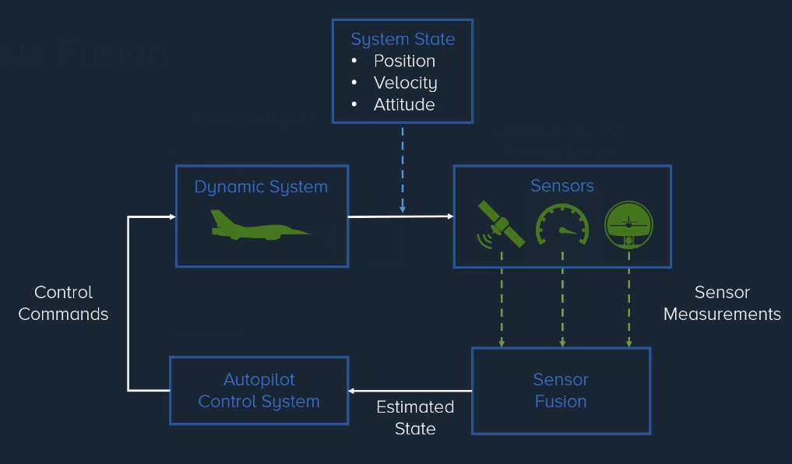

# Advanced Kalman Filtering and Sensor Fusion

## What is Sensor Fusion?
- Sensor fusion is the process of combining sensor data or data derived from disparate sources such that the resulting information has less uncertainty than would be possible when these sources were used individually.
- Data Fusion is the process of integrating **multiple** data sources to form useful information that is more **consistent** and more **accurate** than the original data sources.

