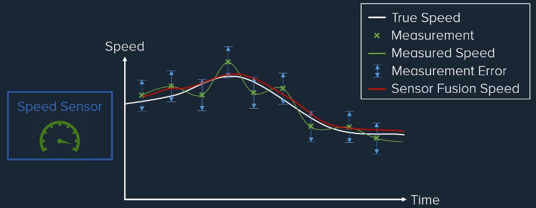

# Advanced Kalman Filtering and Sensor Fusion

## What is Sensor Fusion?
- Sensor fusion is the process of combining sensor data or data derived from disparate sources such that the resulting information has less uncertainty than would be possible when these sources were used individually.
- Data Fusion is the process of integrating **multiple** data sources to form useful information that is more **consistent** and more **accurate** than the original data sources.
<p align="center"></p>
<p align="center"></p>

## How does sensor fusion work?
- Data fusion is a wide subject area, so we will concentrate on the most powerful method in this, which is Bayesian or probabilistic data fusion for the application of sensor fusion or state estimation. This is where the state of the dynamic system to be estimated is encoded as a probability distribution. This probability distribution is then updated with the probability distributions of sensor measurements or other sources of information to form the most optimum estimatge of the state of the system.
数据融合是一个广泛的学科领域，因此我们将专注于其中最强大的方法，即贝叶斯或概率数据融合，用于传感器融合或状态估计的应用。这是将要估计的动态系统的状态编码为概率分布的地方。然后用传感器测量或其他信息源的概率分布更新该概率分布，以形成系统状态的最佳估计
- Probability provides a very powerful framework to build data fusion algorithms upon, it helps encapsulate the inherent uncertainty about the model and measurement processes and helps us to know how accurate are the state estimates.
概率提供了一个非常强大的框架来构建数据融合算法，它有助于封装模型和测量过程的固有不确定性，还有助于我们了解状态估计的准确性。
- Sensor data fusion is usually split into two phases and most estimation processes follow a similar process of breaking the problem down into two recursive steps:
传感器数据融合通常分为两个阶段，大多数估计过程遵循将问题分解为两个递归步骤的类似过程：
- **Prediction Step**: to calculate the best estimate of the state for the current time using all the available information we have at that time. This is where the uncertainty in the estimates grows.
预测步骤：使用我们当时拥有的所有可用信息计算当前时间状态的最佳估计。这是估计的不确定性增加的地方。
- **Update Step**: where the current best state estimate is updated measurements or information when they become available, to produced an even better estimate. This is where the uncertainty in the estimate shrinks.
更新步骤：当前最佳状态估计是在可用时更新测量或信息，以产生更好的估计。这是估计中的不确定性缩小的地方。
- Now these two steps don't have to be run in sequence, you might have different sensors or measurement being made at different rates, so you might make multiple prediction steps before the next measurement update is fused in. You can also fuse in multiple sensors at the same time.
现在这两个步骤不必按顺序运行，您可能有不同的传感器或以不同的速率进行测量，因此您可以在融合下一个测量更新之前进行多个预测步骤。您也可以融合多个传感器同时。

## Background Theory
### Section Outline
- The Kalman Filter is built upon some fundamental concepts. While this course assumes a working knowledge of these areas, we will very quickly cover the basics as a review.

- After each quick review of the topics, there will be a quiz to see if you have the concepts handled. If you need help understanding the concepts further please look into the additional internal and external course resources.

#### Background Topics
- Basic Probability
- Probability Density Functions (Gaussian in particular)
- Multivariate Distributions
- Linear Transformation of Distributions
- Differential Equations
- State Space Representation
- Continuous vs. Discrete Time Models
- Types of Mathematical Models of Systems
- Estimation as a Probability Problem

#### Basic Probability
- Probability is a mathematical way of described the likelihood of an event happening. For any Event A, the probability is: $0 \leq P(A) \leq 1$
- If S is a set of possible events, then the sum of all probabilities in the set must be equal to: $\sum_{e\in S} P(e) = 1$
- If we know the probability of event A occurring, then the probability of event A not occuring is simply: $P(\urcorner A) = 1-P(A)$

#### Mutually Exclusivity
- Mutually Exclusive Events
  
  ```ditaa {cmd=true }
                      +-------+  +-------+
                      |       |  |       |
                      | Event |  | Event |
                      |       |  |       |
                      |   A   |  |   B   |
                      +-------+  +-------+
  ```
  (Event A and Event B ***can not*** occur at the same time)
  Mathematically it can be written as a probability of event A and event B occurring at the same time is equal to zero $P(A \quad\text{and}\quad B) = 0$
  We can say the probability of event A occurring or event B occurring is just a sum of the probabilities. $P(A \quad\text{or}\quad B) = P(A) + P(B) = 1$

- Non-Mutually Exclusive Events
  ```ditaa {cmd=true args=["-E"]}
                      +-------+---------+-------+
                      |       |         |       |
                      | Event | A and B | Event |
                      |       |         |       |
                      |   A   |         |   B   |
                      +-------+---------+-------+
  ```

  (Event A and Event B ***can*** occur at the same time)
  Mathematically it can be written as a probability of event A and event B occurring at the same time is equal to non-zero $P(A \quad\text{and}\quad B) \neq 0$
  We add up the area of A plus the area of B, we would have already counted (A \quad\text{and}\quad B) area twice, then we have to subtract this amount. $P(A \quad\text{or}\quad B) = P(A) + P(B) - P(A \quad\text{and}\quad B)$

#### Conditional Probability
- Events can be considered independent if the likelihood of one event does not affect the likelihood of another occuring.(l.e Roll of a dice, toss of a coin)
- Dependant events are the opposite. When one event occurs it changes the probability of the other events.
- The probability of Event A and Event B occurring if they are dependent:
$$P(A \quad\text{and}\quad B) = P(A)P(B|A)$$
- Conditional Probability:事件A在事件B的条件下发生的概率
$$Conditinal ProbabilityP(A|B) = {Joint ProbabilityP(A \quad\text{and}\quad B) \over Marginal ProbabilityP(B)}$$
- Independent Events:
$$P(A \quad\text{and}\quad B) = P(A)P(B)$$
$$P(A|B) = P(A)$$
$$P(B|A) = P(B)$$

#### Bayes' Theorem
- Bayes' Theorem or Bayes' Rule is one of the most important concepts used in Bayesian Estimation(i.e. Probabilistic Estimation)
- Bayes' Theorem allows you to calculate the likelihood or bounds on an unknown parameter or event based on prior information related to that event (Bayesian inference)
$$Conditional P(A|B) = {Conditional P(B|A) Marginal P(A) \over Marginal P(B)}$$

<details><summary> Quiz 1: Basic Probability Quiz </summary><div>

1. Probability is the likelihood that a certain event will occur. Let $P(A)$ be the probability that event A will occur. Selet the valid value of $P(A)$:

The valid range is $0 \leq P(A) \leq 1$

2. Let S be a set of all possible events $S={A,B,C,D}$. If $P(A)=0.1$ and $P(B)=0.4$, what is the probability that $P(C or D)$ will occur:

The sum of probability must equal 1, so if $P(A \quad\text{or}\quad B or C or D) = P(A) + P(B) + P(C) + P(D) = 1$, $P(C) + P(D) = 1 - 0.5 = P(C or D)$ 

3. Let S be a set of all possible events $S={A,B,C,D}, P(A)=0.1, P(B) = 0.4, P(not D) = 0.9$, What is the probability of $P(C)$ and $P(D)$:

$$P(D) = 1 - P(not D) = 1 - 0.9 = 0.1; P(C) = 1 - P(A) - P(B) - P(D) = 1 - 0.1 - 0.4 - 0.1 = 0.4$$

4. Let S be a set of events $S = {A,B}$. $P(A) = 0.5$, $P(A a\quad\text{and}\quadnd B) = 4/14$, What is $P(B)$:

The events are not mutually exclusive, so $P(A \quad\text{or}\quad B) = P(A) + P(B) - P(A \quad\text{and}\quad B)$. $P(A \quad\text{or}\quad B) = 1$, therefore $P(B) = 1 - 7/14 + 4/14 = 11/14$

5. A normal full deck of playing cards has 52 cards, with half black and the other half red. So that P(red) = 0.5, P(black) = 0.5. If you randomly select 2 cards from the deck without replacing the card you pulled out, what is the probability of drawing a red card followed by a black card?
Conditional Probability: $P(A \quad\text{and}\quad B) = P(A)P(B|A)$

The probability of drawing a red card is $P(red) = \frac{26}{52}$, then the probability of drawing a black card is $P(black) = \frac{26}{51}$, beacause we already have drew one card. So only 51 card left. $P(A \quad\text{and}\quad B) = \frac{26}{52}\frac{26}{51} \approx 0.255$

6. If $P(A \quad\text{and}\quad B) = P(A)P(B)$, then the events can be considered (select the most correct):
- [x] Independent

7. Given the following information:
It has rained 18 days out of the last 30 days, so that P(rain).
There is a 48% chance of it to be cloudy this morning P(cloudy).
On the days it has rained, 68% of the time it was cloudy in the morning $P(cloudy|rain)$
What is the likelihood of rain today?
Hint: Bayes’ Theorem $P(A|B) = P(B|A) P(A) / P(B)$, find $P(rain|cloudy)$

$$P(rain|cloudy) = \frac{P(cloudy|rain)P(rain)} {P(cloudy)} = 85$$ 
</div></details>

### Probability Density Functions
####Random Variable
- Mathematics is a very precise and deterministic field, so a way of expressing random events and uncertainties is required.
- A random variable is a way to mathematically express stochastic outcomes as real numbers.
$$X : S \rightarrow E$$
The random variable X has the possibility of being any of the real numbers in E.
However once the experiment has been carried out the value of the random variable or outcome has been determined. You can then treat the random value as any normal algebraic value.

- Let's say we have a random variable X, but we would like to know how likely each outcome is to occur. Is each outcome equally as likely(ie. a toss of a coin) or are some outcomes more likely to occur than others?
- We describe and quantify this with Probability Density Functions.
- PDFs measure the relative likelihood or probability that a specific outcome will occur.
<p align="center"></p>

$$P(a \leq X \leq b) = \int_{a}^{b} f_X(x) dx $$
$$\int_{-\infty}^{\infty} f_X(x) dx $$

<p align="center"></p>

$$P(X = -0.75) = 0$$
$$P(-1 \leq X \leq -0.75) = 0.25 \times 0.5 = 0.125$$

### Expectation Operator
- Now that we have defined what a PDF for a random variable is, and how to calculate the probability of certain events happening. A core operation that can be applied to a PDF is the expectation operator:
$$E(X) = \int_{-\infty}^{\infty} xf_X(x) dx $$
- The expected value or mean of the random variable is usually for simplicity written as:
$$\bar{X} = \bar{x} = E(X)$$
- It is very useful to be able to describe a probability density function or distribution in a few key properties:
  - Mean
  - Variance
  - Skew
- We can now calculate these properties of a distribution by using the expectation operator.
#### Distribution Mean(First Moment)
- The mean of a distribution is just the expected value:
$$\bar{x} = E(X) $$
<p align="center"></p>

#### Distribution Variance(Second Moment)
- The variance of a distribution a measure of how much the distribution varies from the mean:

$$\sigma^2_X = E[(X - \bar{x})^2]$$
$$\sigma^2_X = E[X^2 - X\bar{x} + \bar{x}^2]
             = E(X^2) - 2\bar{x}^2 + \bar{x}^2
             = E(X^2) - \bar{x}^2$$
$$X \sim (\bar{x}, \sigma^2_X) $$

<p align="center"></p>

#### Distribution Skewness(Third Moment)
- The skew of a distribution a measure the asymmetry of the distribution from the mean:
$$skew = E[(X - \bar{x})^3]$$

$$skewness = skew / \sigma^3_X$$

<p align="center"></p>

<details><summary> Quiz2: Probability Density Function Quiz </summary><div>
1. The probability density function shows the likelihood that a specific outcome will occur. If the PDF was integrated from -ve to +ve infinity the value would be:
- [x] 1
The total area under the curve must equal 1 for it to be a valid PDF

2. Let $f_X(x)$ be a PDF for the random variable X and let $f_X(x)$ be a constant value of 0.5 between -1 and 1 and zero everywhere else. $[f_X(x)=0.5 if -1 \leq x \leq 1 else f_X(x) = 0]$. What is the probability of getting a $0.5P(0.5) = ?$
  
- Beacause curve at a single point area is $$P(X=0.5) = 0$$

3. Let $f_X(x)$ be a PFD for the random variable X, where $f_X(x)$ is shown below. What is the probability of getting a number less than -0.25?

$$P(-1 < X < -0.25) = 0.75 \times 0.5 = 0.375$$

4. The expectation operator can be calculate using the $$E(X) = \int_{-\infty}^{\infty} xf_X(x) dx $$ What is the expected value of a PDF shown below:
<p align="center"></p>

The expectation operator is simply the mean of the distribution $$E(X) = (2+6)/2 = 4$$

5. Which statement about a PDF that has a high variance is incorrect
- [x] The peak maximum likelihood is very large
The peak likelihood must be small since the total area for the wide spread must always equal 1. 
</div></details>

### Multivariate Probability
#### Multiple Random Variables
- Let X be a random variable with a pdf of $f_X(x)$ and also let Y be a random variable with a pdf of $f_Y(y)$. It is possible to define the pdf for the joint probability (i.e. probability of X and Y) as $f_XY(x,y)$ or $f(x,y)$ for short.
- Joint Probability:
$$P(a \leq X \leq b \quad\text{and}\quad c \leq Y \leq d) = \int_c^d \int_a^b f(x,y)dx dy$$

#### Marginal Density Functions
$$f_X(x) = \int_{-\infty}^{\infty} f(x,y) dy$$
$$f_Y(y) = \int_{-\infty}^{\infty} f(x,y) dx$$

#### Expected Value
- Single Random Variable:
$$E[g(x)] = \int_{-\infty}^{\infty} g(x)f_X(x) dx$$

- Multiple Random Variable:
$$E[g(x,y)] = \int_{-\infty}^{\infty} \int_{-\infty}^{\infty} g(x,y) f(x,y) dx dy$$

#### Independent Random Variables
- Basic Probability Condition:
$$P(A \quad\text{and}\quad B) = P(A) P(B)$$

- Density Function Condition:
$$f_XY(x,y) = f_X(x)f_Y(y)$$

#### Expected Value of Multiplication of Independent Random Variables
$$E(XY) = \int\int XY f_XY(x,y) dx dy$$
$$E(XY) = \int\int XY f_X(x)f_Y(y) dx dy$$
$$E(XY) = \int X f_X(x) dx \int Yf_Y(y) dy$$
Assuming Independence
$$E(XY) = E(X)E(Y)$$

#### Expected Value of Sum of Independent Random Variables
$$z(x,y) = g(x)+h(y)$$
$$E[z(x,y)] = E[g(x) + h(y)]$$
$$E(z) = \int\int[g(x)+h(x)]f(x,y)dxdy$$
$$E(z) = \int\int g(x)f_X(x)f_Y(y)dxdy + \int\int h(y)f_X(x)f_Y(y)dxdy$$
$$E(z) = \int g(x)f_X(x)dx \int f_Y(y)dy + \int h(y)f_Y(y)dy \int f_X(x)dx$$
$$E(z) = E[g(x)] + E[h(y)]$$
$$z=x+y$$
$$E(x+y)=E(x)+E(y)$$

#### Dependant Random Variables
- The random variables might not be independent, there might be some correlation between the two.
<p align="center"></p>
Covariance:

$$C_{XY} = E[(X-\bar x)(Y - \bar y)] = E(XY) - \bar x \bar y $$

Correlation Coefficient:

$$\rho = {C_{XY} \over \sigma _x \sigma _y}$$

#### Multivariate Random Vectors
- We can generalize single random variables into vector form:
Each Element is a Random Vraiable

$$X = \begin{bmatrix}
        X_1 \\
        X_2 \\
        \vdots \\
        X_n
      \end{bmatrix}
      \quad\quad\quad 
  Y = \begin{bmatrix}
        Y_1 \\
        Y_2 \\
        \vdots \\
        Y_m
      \end{bmatrix}$$

#### Multivariate Mean
- The mean can be calculated in the same way, but on a per element basis:

$$X = \begin{bmatrix}
        X_1 \\
        X_2 \\
        \vdots \\
        X_n
      \end{bmatrix}
      \quad\quad\quad 
  \bar X = E(X) = \begin{bmatrix}
        E(X_1) \\
        E(X_2) \\
        \vdots \\
        E(X_n)
      \end{bmatrix}$$

#### Multivariate Covariance
- The covariance between two random variable vectors can be calculated, which now forms a matrix of covariance values:

$$X = \begin{bmatrix}
        X_1 \\
        X_2 \\
        \vdots \\
        X_n
      \end{bmatrix}
      \quad\quad\quad
  C_{XY} = E[(X-\bar{X})(Y-\bar{Y})^T]=E[(XY^T)-\bar{X}\bar{Y}^T]$$

$$Y = \begin{bmatrix}
        Y_1 \\
        Y_2 \\
        \vdots \\
        Y_m
      \end{bmatrix}
      \quad\quad\quad
  C_{XY} = \begin{bmatrix}
            C_{X_1}{Y_1} & C_{X_1}{Y_2} &\dots& C_{X_1}{Y_m} \\
            C_{X_2}{Y_1} & C_{X_2}{Y_2} &\dots& C_{X_2}{Y_m} \\
            \vdots& \vdots& \vdots& \vdots\\
            C_{X_n}{Y_1} & C_{X_n}{Y_2} &\dots& C_{X_n}{Y_m} 
            \end{bmatrix}$$

#### Autocorrelation Matrix
- The autocorrelation matrix, is simply the covariance matrix for the random vector and itself:
$$C_{X} = E[(X-\bar{X})(X-\bar{X})^T]$$
$$C_{XY} = \begin{bmatrix}
            \sigma_{X_1}^2 & \sigma_{X_1}{X_2} &\dots& \sigma_{X_1}{X_n} \\
            \sigma_{X_2}{Y_1} & \sigma_{X_2}^2 &\dots& \sigma_{X_2}{Y_n} \\
            \vdots& \vdots& \vdots& \vdots\\
            \sigma_{X_n}{X_1} & \sigma_{X_n}{X_2} &\dots& C_{X_n}^2
            \end{bmatrix}$$

#### Covariance Matrix Properties
- The covariance matrix(autocorrelation) is :
  - Symmetric
  - Positive Semidefinite
  $$\sigma_{ij} = \sigma_{ji}$$
  $$C_{X} = C_{X}^T$$
  $$z^{T} C_{X} z \geq 0$$